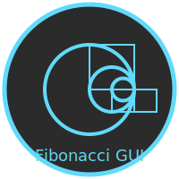

# Fibonacci Sequence Generator GUI
---
[In Python]()

[In C Script]()



---
Welcome to the **Fibonacci Sequence Generator GUI** project! This application provides an easy and interactive way to generate Fibonacci sequences of any length. With a user-friendly interface, you can input the number of terms you'd like to generate and instantly see the results. 🌟

## 📝 Table of Contents
- [Features](#-features)
- [How It Works](#-how-it-works)
- [Installation](#-installation)
- [Usage](#-usage)
- [License](#-license)
- [Contact](#-contact)

## 🌟 Features
- **Dynamic Fibonacci Generation:** Enter the desired number of terms, and instantly generate a Fibonacci sequence.
- **Light/Dark Mode Toggle:** Switch between light and dark themes for a comfortable viewing experience.
- **Clean and Modern UI:** A simple yet effective graphical user interface (GUI) using PySide6 and QML.
- **Easy Exit:** Convenient exit button for quickly closing the application.

## 🎯 How It Works
The Fibonacci sequence is a series of numbers where each number is the sum of the two preceding ones, typically starting with 0 and 1. This application calculates the Fibonacci sequence based on the number of terms you input.

Here's how the application works:

1. **Input:** Enter the number of terms you wish to generate in the input field.
2. **Generate:** Click the "Generate" button to see the Fibonacci sequence displayed in both a list view and a text area.
3. **Exit:** Click the "Exit" button at the top left to close the application.
4. **Theme Switch:** Use the toggle at the top right to switch between light and dark themes.

## 💻 Installation
To get started with the Fibonacci Sequence Generator, follow these steps:

1. **Clone the Repository:**
   ```bash
   git clone https://github.com/mdriyadkhan585/fibonacci-sequence-generator-gui.git
   cd fibonacci-sequence-generator-gui
   ```

2. **Install Dependencies:**
   Make sure you have Python installed. Then, install the required Python packages:
   ```bash
   pip install PySide6
   ```

3. **Run the Application:**
   ```bash
   python main.py
   ```

## 🚀 Usage
### Step-by-Step Guide:

1. **Launch the Application:** Run the `main.py` script.
2. **Enter Terms:** In the input field, enter the number of Fibonacci terms you want to generate.
3. **Generate:** Click the "Generate" button. The Fibonacci sequence will be displayed below.
4. **Switch Themes:** Toggle the theme using the switch in the top right corner.
5. **Exit:** Close the application by clicking the "Exit" button in the top left corner.

### Example:

- **Input:** 5
- **Output:** The sequence `0, 1, 1, 2, 3` will appear in the list view and text area.


## 📜 License
This project is licensed under the MIT License. See the `LICENSE` file for details.

## 📞 Contact
For any questions or suggestions, feel free to reach out:
- **Email:** mdriyadkhan585@example.com
- **GitHub:** [GitHub](https://github.com/mdriyadkhan585)

Enjoy generating Fibonacci sequences! ✨

---
